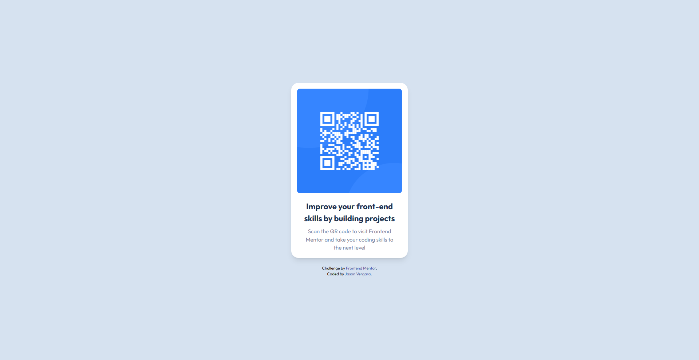

# Frontend Mentor - QR code component solution

This is a solution to the [QR code component challenge on Frontend Mentor](https://www.frontendmentor.io/challenges/qr-code-component-iux_sIO_H). Frontend Mentor challenges help you improve your coding skills by building realistic projects. 

## Table of contents

- [Overview](#overview)
  - [Screenshot](#screenshot)
  - [Links](#links)
- [My process](#my-process)
  - [Built with](#built-with)
  - [What I learned](#what-i-learned)
- [Author](#author)

## Overview

### Screenshot



### Links

- Solution URL: [Solution](https://github.com/JasonRavager/QR-Code-Component/tree/main)
- Live Site URL: [Vercel](https://qr-code-component-pi-taupe.vercel.app/)

## My process

### Built with

- Semantic HTML5 markup
- CSS custom properties
- Tailwind CSS
- Mobile-first workflow

### What I learned

The most important learning I've got from this challenge is deploying in Vercel since it is my first time to do so. The first time I deployed, the CSS was not working and the images was not loading. I then had to tweak the addresses in my index.html.

From this:
```html
  <link rel="stylesheet" href="/dist/css/styles.css">
```
to this:
```html
<link rel="stylesheet" href="./css/styles.css">
```

Although both codes work in my localhost, the former does not in Vercel App.

## Author

- Frontend Mentor - [@JasonRavager](https://www.frontendmentor.io/profile/JasonRavager)
- Twitter - [@jr_ver1](https://www.twitter.com/yourusername)